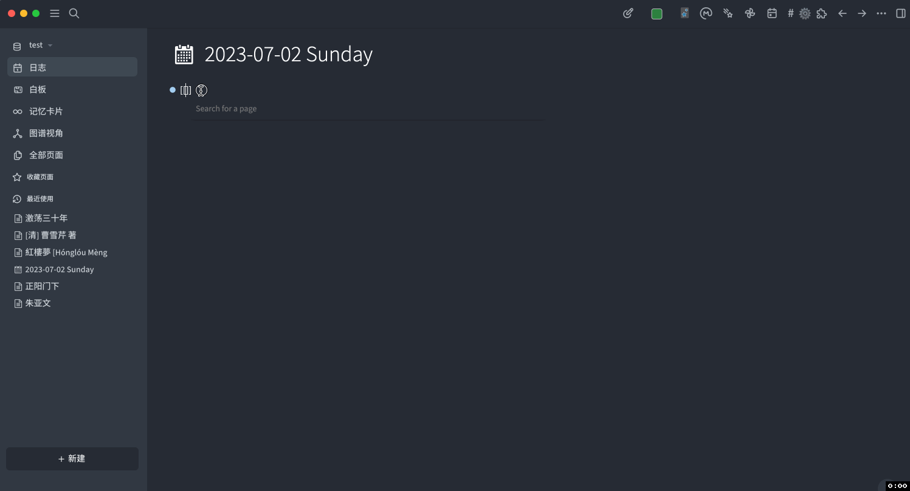

- # loseq-insert-movie-properties

  - > A plugin to insert movie information or actor information in [Logseq](https://logseq.com/) .

  - **📢Attention: This plugin is still actively under development, so the inserted attributes and their behavior may change in the future. Please choose carefully.**

- ## Features

  - Insert movie information on the movie page as page properties, supporting both English and Chinese.
    - 
    - 
  - Insert actor information on the actor page as page properties, supporting both English and Chinese.
    - 
    - 
  - Insert book information as a page properties
    - 

- ## Demos

  - ### English Movie
    - 
  - ### Chinese Movie
    - 
  - ### TV
    - 
  - ### Book
    - 

- ## Thanks

  - ### [TMDB](https://www.themoviedb.org/)
    - Thanks to TMDB for providing the API
  - ### [NeoDB](https://neodb.social/)
    - Thanks to NeoDB for providing the API

- ## Licenses
  - [MIT](https://choosealicense.com/licenses/mit/)
