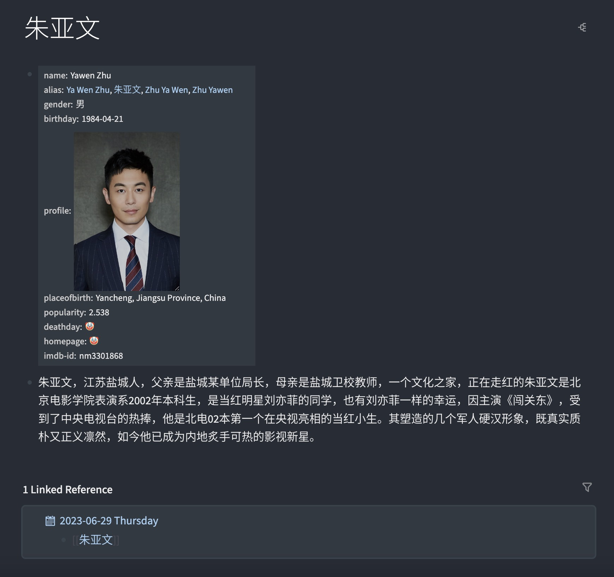

- # loseq-insert-movie-properties
  - > A plugin to insert movie information or actor information in [Logseq](https://logseq.com/) .

- ## Features
	- Insert movie information on the movie page as page attributes, supporting both English and Chinese.
		- 
		- 
	- Insert actor information on the actor page as page attributes, supporting both English and Chinese.
		- 
		- 

- ## Demos
	- ### English
	- 
	- ### Chinese
	- 

- ## Thanks
  - ### [TMDB](https://www.themoviedb.org/)
    - Thanks to TMDB for providing the API

- ## Licenses
  - [MIT](https://choosealicense.com/licenses/mit/)