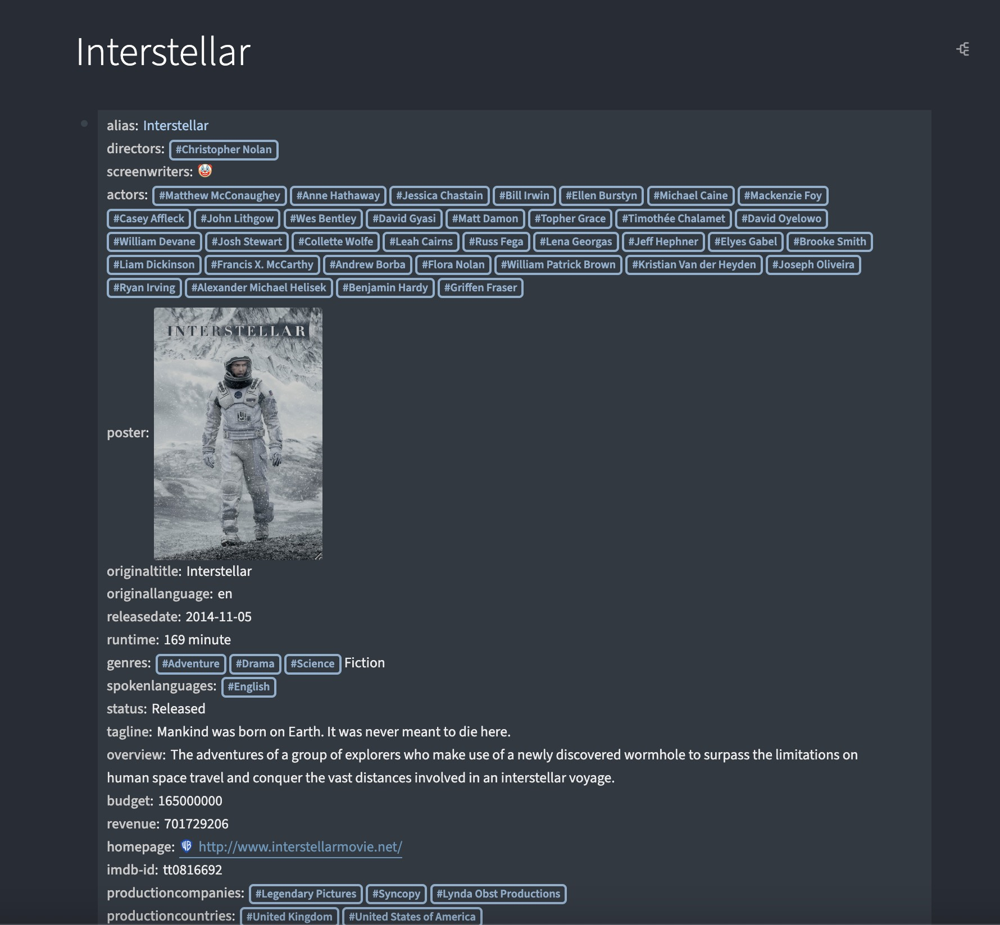
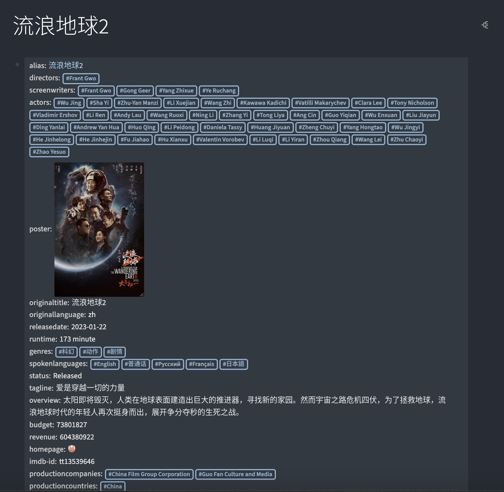
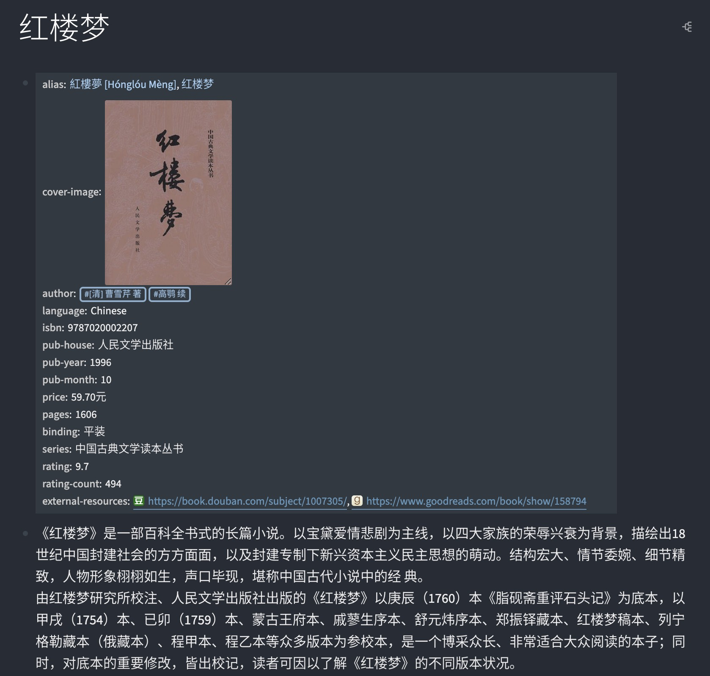
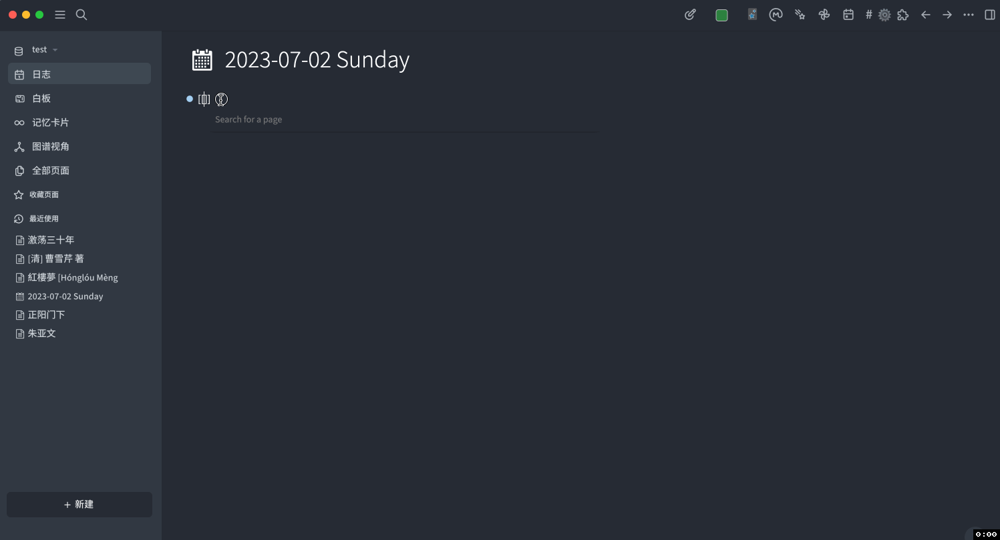

- # loseq-insert-movie-properties

  - > 在 [Logseq](https://logseq.com/) 中插入电影信息或演员信息的插件
  - **📢 注意: 该插件仍然在积极开发中，所以目前插入的属性和后期比可能会有变动，请谨慎选择。**

- ## 功能

  - 在电影页面插入该电影的信息作为页面属性，支持英文和中文
    - 
    - 
  - 在演员页面插入该演员的信息作为页面属性，支持英文和中文
    - 
    - 
  - 插入书籍信息作为页面属性
    - 

- ## 演示

  - ### 英文电影
    - 
  - ### 中文电影
    - 
  - ### 电视剧
    - 
  - ### 书籍
    - 

- ## 鸣谢

  - ### [TMDB](https://www.themoviedb.org/)
    - 感谢 TMDB 提供 API
  - ### [NeoDB](https://neodb.social/)
    - 感谢 NeoDB 提供 API

- ## 许可证
  - [MIT](https://choosealicense.com/licenses/mit/)
